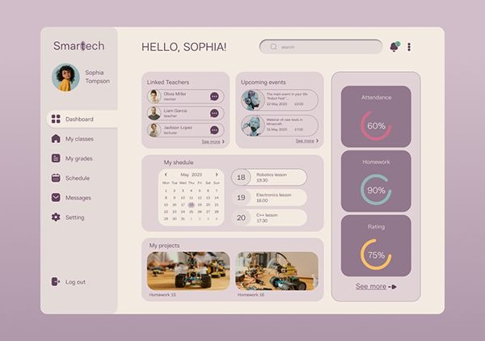

# NudgeBox 🧠🚀

> **The job market is brutal. Getting an interview is a miracle. Missing it because it got buried in your inbox is a tragedy.**
> 
> NudgeBox is your AI exoskeleton for the job hunt. It's a privacy-first, fully autonomous agent that connects to your Gmail, reads your inbox looking for Interview invites and Online Assessments (OAs), and durably schedules aggressive multi-channel nudges at **T-7 days, T-1 day, morning-of, and T-1 hour**.



---

## 🌟 Features (The Prize Layers)

We didn't just build a cron job. We built a resilient, AI-native distributed system to make sure you *never* miss an interview.

1. **🧠 Bulletproof LLM Extraction (Gemma 3)**
   - We use Google's **Gemma 3** (served via Ollama or any OpenAI-compatible GPU endpoint) to read emails and output strict JSON schemas. 
   - **Evaluated at 100% Accuracy:** We built a custom evaluation suite (`eval/run2.py`) to test against synthetic prompt injections and weird timezone edge cases.
2. **⏳ Durable Execution (Temporal)**
   - When NudgeBox says "sleep for 7 days," it doesn't leave a Python thread hanging. It serializes the sleep state to a **Temporal** database. You can literally kill the server, deploy new code, and restart it 5 days later—the workflow will wake up exactly when it's supposed to.
3. **🔊 Multi-Channel Hype (ElevenLabs + Telegram)**
   - At T-1 hour, you don't just get a text. NudgeBox uses **ElevenLabs** to generate an enthusiastic, high-quality audio voice note telling you you're going to crush the interview, and drops the `.mp3` directly into your Telegram DMs.
4. **🔍 Semantic Few-Shot Retrieval (MongoDB Atlas Vector Search)**
   - Before hitting the LLM, we sanitize the event (removing PII) and generate a 768-dimension vector using Ollama. We index this in **MongoDB Atlas Vector Search** so we can dynamically pull the 3 most similar past emails as few-shot context for tricky parser edge-cases.
5. **🕵️‍♂️ Distributed Tracing (Sentry)**
   - The FastAPI backend and the Temporal Worker are fully instrumented with **Sentry SDK**. If Gemma hallucinates a weird JSON shape or an API fails, we get 100% distributed trace captures instantly.
6. **🚀 Infrastructure as Code (Render)**
   - The entire stack is orchestratable via a single `render.yaml` Blueprint, isolating the web UI, the backend API, and the background worker into discrete scaling groups.

---

## 🏗️ Architecture

- **Frontend**: React + Vite + TypeScript (Custom Glassmorphism CSS, zero bloated frameworks).
- **Backend**: Python, FastAPI, Temporalio, Pydantic AI (Instructor).
- **Database**: MongoDB Atlas + Vector Search.
- **LLM**: Gemma 3 via Ollama (`nomic-embed-text` for embeddings).
- **Notifications**: Telegram Bot API, ElevenLabs TTS.

---

## 🧪 Why Temporal? (The "Kill-Worker" Experiment)

Why didn't we just use a cron job or a background thread to send reminders?

NudgeBox schedules reminders up to **7 days** in the future. In a traditional architecture, if your server crashes, restarts, or deploys new code on day 3, all pending `setTimeout` calls or in-memory queues are wiped out. Your users would miss their interviews.

**Temporal provides Durable Execution.**

When a NudgeBox workflow says "sleep for 7 days," Temporal serializes the state of that function and saves it to the database. The worker process can safely be killed, restarted, or moved to another machine.

### Try it yourself (The Ultimate Demo):
1. Start the Temporal worker: `python backend/worker/main.py`
2. Seed an event 10 minutes in the future: `python backend/worker/seed_event.py --in-minutes 10`
3. Check the Temporal UI (`http://localhost:8233`). You will see the workflow is in a "Sleeping" state.
4. **Kill the python worker process (Ctrl+C).** Notice how the workflow in the UI does *not* fail. It just waits patiently.
5. Wait 9 minutes.
6. Restart the python worker process.
7. The worker immediately resumes exactly where it left off, connects to ElevenLabs, and fires the T-1h voice note to your Telegram!

You cannot do this reliably with CRON without writing complex, bug-prone state machines in your database. Temporal makes it look like a simple `asyncio.sleep()`.

---

## 💻 How to run locally

### Prerequisites
- Python 3.10+
- Docker
- Ollama (`ollama pull gemma3` & `ollama pull nomic-embed-text`)
- Node.js 20+

### Setup

1. Copy `.env.example` to `.env` and fill in the values:
   ```bash
   cp .env.example .env
   ```

2. Start the local infrastructure (MongoDB, Temporal, Ollama):
   ```bash
   docker compose up -d
   ```

3. Create and activate a virtual environment:
   ```bash
   python -m venv .venv
   
   # Windows:
   .venv\Scripts\activate
   # macOS/Linux:
   source .venv/bin/activate
   ```

4. Install backend dependencies:
   ```bash
   pip install -r requirements.txt
   ```

5. Run the API and Worker (in separate terminals):
   ```bash
   uvicorn backend.api.main:app --reload --port 8000
   python -m backend.worker.main
   ```

6. Run the Frontend (in a separate terminal):
   ```bash
   cd frontend
   npm install
   npm run dev
   ```

7. Access the services:
   - Dashboard: http://localhost:5173
   - API Docs: http://localhost:8000/docs
   - Temporal UI: http://localhost:8233

---

## ☁️ Cloud Deployment (Render)

We use Render's Blueprint (`render.yaml`) to deploy our microservices:
1. `nudgebox-api`: The FastAPI web server.
2. `nudgebox-frontend`: The Vite/React web dashboard.
3. `nudgebox-temporal-worker`: The Python background worker.

**Environment variables required in Render dashboard:**
- `GOOGLE_CLIENT_ID` / `GOOGLE_CLIENT_SECRET`: Your Google OAuth credentials
- `TOKEN_ENCRYPTION_KEY`: For envelope encryption of refresh tokens
- `MONGODB_URI`: Your MongoDB Atlas Connection String
- `TELEGRAM_BOT_TOKEN`: The bot token from @BotFather
- `ELEVENLABS_API_KEY`: API key for VoiceNotifier
- `OPENAI_API_KEY` / `OPENAI_BASE_URL`: Configuration for your chosen cloud GPU serving Gemma 3 (e.g. DigitalOcean, vLLM).
- `TEMPORAL_ADDRESS`: The gRPC endpoint for Temporal Cloud (or a self-hosted Temporal instance).
- `SENTRY_DSN`: Your Sentry project URL for distributed tracing.
