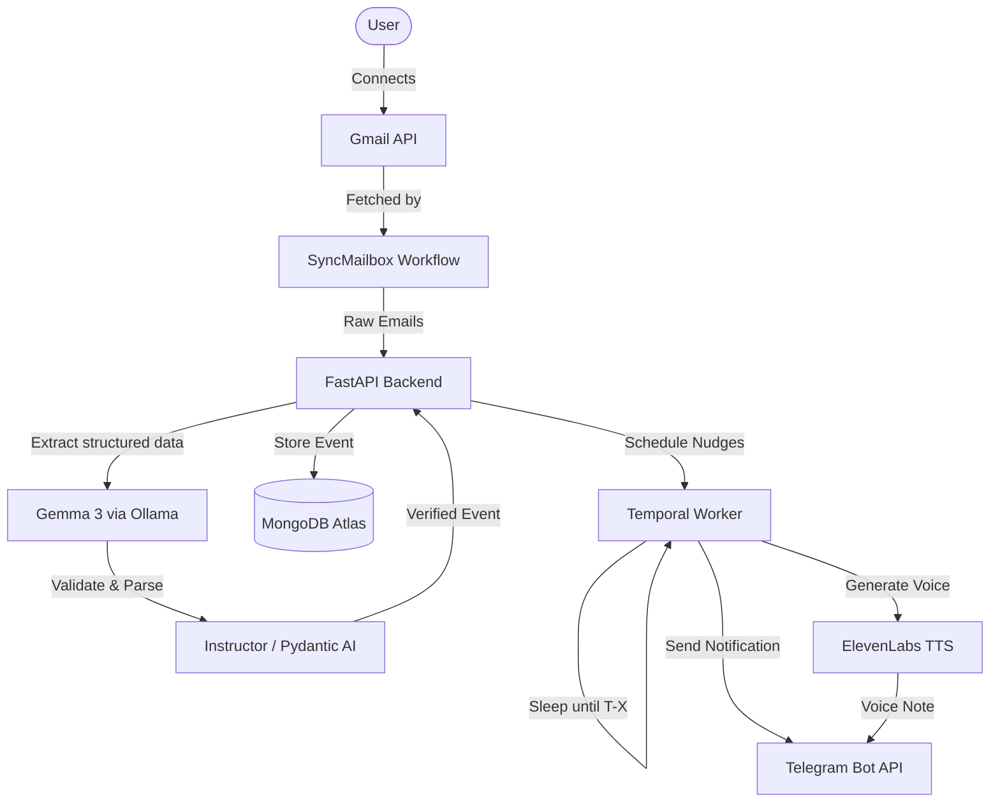

# NudgeBox

NudgeBox is a privacy-first autonomous agent that connects to a user's Gmail, extracts interview invites and online assessments (OAs) using local LLMs, and schedules multi-channel notifications (T-7 days, T-1 day, morning-of, and T-1 hour) to ensure users never miss an important career event.


---

## Architecture Diagram



---

## Features

1. **LLM Extraction (Gemma 3)**
   - Uses **Gemma 3** (via Ollama or an OpenAI-compatible endpoint) to parse unstructured email text into strict JSON schemas using `instructor`.
2. **Durable Execution (Temporal)**
   - Utilizes **Temporal** to orchestrate long-running sleep states (up to 7 days). Workflows serialize state to the database, ensuring reminders are not lost during server restarts.
3. **Multi-Channel Notifications (ElevenLabs + Telegram)**
   - Sends Telegram text reminders. At T-1 hour, it dynamically generates an audio voice note using the **ElevenLabs** API.
4. **Semantic Search (MongoDB Atlas Vector Search)**
   - Embeds sanitized event data using `nomic-embed-text` and indexes it in **MongoDB Atlas Vector Search** for semantic nearest-neighbor retrieval.
5. **Distributed Tracing (Sentry)**
   - Both the FastAPI backend and Temporal worker are instrumented with **Sentry SDK** for error tracking.
6. **Infrastructure as Code (Render)**
   - Orchestrated via a `render.yaml` Blueprint for deployment.

---

## Tech Stack

- **Frontend**: React, Vite, TypeScript, Custom CSS
- **Backend**: Python, FastAPI, Temporalio, Pydantic, Instructor
- **Database**: MongoDB Atlas + Vector Search
- **LLM**: Gemma 3 (via Ollama)
- **Notifications**: Telegram Bot API, ElevenLabs TTS

---

## Durable Execution Demonstration (Temporal)

NudgeBox relies on Temporal to survive server crashes while waiting to send reminders. 

To test this resilience locally:
1. Start the Temporal worker: `python -m backend.worker.main`
2. Seed an event 10 minutes in the future: `python backend/worker/seed_event.py --in-minutes 10`
3. Check the Temporal UI (`http://localhost:8233`). You will see the workflow is in a "Sleeping" state.
4. **Kill the python worker process (Ctrl+C).** The workflow in the UI will wait patiently.
5. Wait 9 minutes.
6. Restart the python worker process.
7. The worker immediately resumes exactly where it left off and fires the T-1h notification.

---

## How to run locally

### Prerequisites
- Python 3.10+
- Docker
- Ollama (`ollama pull gemma3` & `ollama pull nomic-embed-text`)
- Node.js 20+

### Setup

1. Copy `.env.example` to `.env` and fill in the values:
   ```bash
   cp .env.example .env
   ```

2. Start the local infrastructure (MongoDB, Temporal, Ollama):
   ```bash
   docker compose up -d
   ```

3. Create and activate a virtual environment:
   ```bash
   python -m venv .venv
   
   # Windows:
   .venv\Scripts\activate
   # macOS/Linux:
   source .venv/bin/activate
   ```

4. Install backend dependencies:
   ```bash
   pip install -r requirements.txt
   ```

5. Run the API and Worker (in separate terminals):
   ```bash
   uvicorn backend.api.main:app --reload --port 8000
   python -m backend.worker.main
   ```

6. Run the Frontend (in a separate terminal):
   ```bash
   cd frontend
   npm install
   npm run dev
   ```

7. Access the services:
   - Dashboard: http://localhost:5173
   - API Docs: http://localhost:8000/docs
   - Temporal UI: http://localhost:8233

---

## Cloud Deployment (Render)

Deployment is managed via Render's Blueprint (`render.yaml`):
1. `nudgebox-api`: FastAPI web server.
2. `nudgebox-frontend`: Vite/React frontend.
3. `nudgebox-temporal-worker`: Python background worker.

**Required Environment Variables:**
- `GOOGLE_CLIENT_ID` / `GOOGLE_CLIENT_SECRET`: Google OAuth credentials
- `TOKEN_ENCRYPTION_KEY`: For envelope encryption of refresh tokens
- `MONGODB_URI`: MongoDB Atlas Connection String
- `TELEGRAM_BOT_TOKEN`: Telegram bot token
- `ELEVENLABS_API_KEY`: API key for VoiceNotifier
- `OPENAI_API_KEY` / `OPENAI_BASE_URL`: Configuration for cloud GPU endpoint
- `TEMPORAL_ADDRESS`: gRPC endpoint for Temporal Cloud
- `SENTRY_DSN`: Sentry project URL for tracing
